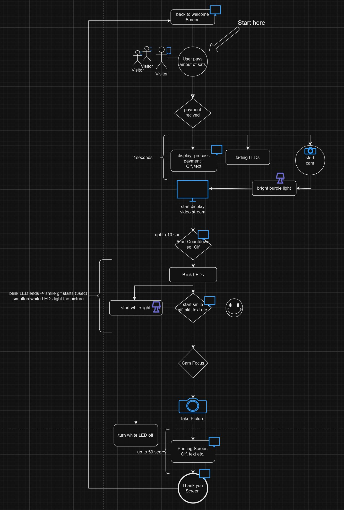

# Doxbox - uma cabine fotográfica com bitcoin ⚡️ lightning

<p align="center">

</p>


## Componentes Principais


- **main.py**: Atua como ponto de entrada da aplicação, orquestrando a execução de vários componentes com base nos modos operacionais.
- **app.py**: Gerencia a interface gráfica do usuário (GUI) da aplicação, facilitando interações do usuário e exibindo informações.
- **switch.py**: Lida com interações de API externas e executa ações específicas com base nos dados recebidos, como acionar outros componentes da aplicação.
- **img_capture.py**: Interage com câmeras para capturar imagens, baixá-las e gerenciar o armazenamento de arquivos, utilizando gphoto2.
- **print.py (Em Progresso)**: Interface com impressoras usando CUPS para imprimir imagens, com funcionalidade para selecionar impressoras e gerenciar trabalhos de impressão.
- **config.py**: Contém configurações usadas em toda a aplicação, como chaves de API, nomes de dispositivos e caminhos de arquivos.


## Requisitos de Hardware

- **Raspberry Pi 4** executando o sistema operacional baseado em Debian [disponível na página oficial de software do Raspberry Pi](https://www.raspberrypi.com/software/operating-systems/).
- **Câmera DSLR**: Canon EOS 450D com pelo menos 1GB de cartão SD. Se usar outra, [verifique a compatibilidade com o gphoto2 no site oficial](http://www.gphoto.org/proj/libgphoto2/support.php).
- **Display**: Waveshare 10.4" QLED Quantum Dot Display Capacitivo (1600 x 720).
- **Impressora**: Xiaomi-Instant-Photo-Printer-1S, suporta o sistema de impressão CUPS, papel fotográfico de 6".
- **LED**: Tira de LED RGB de 4 canais, junto com uma placa de ensaio, cabos de conexão e 4 Mosfets para controle.
- **Material de Construção**: Três chapas de madeira compensada de 80x80cm; o acesso a um cortador a laser pode ser benéfico.
- **Hardware de Montagem**: 20 conjuntos de ímãs de canto (2 peças por conjunto), 40 parafusos de 4mm de diâmetro e 120 porcas de 4mm de diâmetro para fixar os componentes.
- **Cor de spray**: 1 lata de primer, 4 latas da cor real.


  
  
  

## Exemplo de fluxo de programa:


## Instruções de Configuração

1. **Clone o Repositório**: Comece clonando este repositório para sua máquina local.

```sh
git clone https://github.com/j0sh21/DoxBox.git
```

2. **Instale as Dependências**: Certifique-se de que o Python está instalado no seu sistema e, em seguida, instale os pacotes Python necessários.


```sh
pip install -r requirements.txt
```

**Nota**: Alguns componentes podem exigir dependências adicionais a nível de sistema (por exemplo, gphoto2, CUPS).

- Se quiser instalar dependências adicionais a nível de sistema automaticamente, execute install.sh em vez disso:

```sh
cd DoxBox/install
chmod u+x install.sh
./install.sh
```

3. **Configure**: Revise e atualize config/cfg.ini com suas configurações específicas, como nomes de dispositivos, chaves de API e caminhos de arquivos.


```sh
nano cfg.ini
```

## Uso

Para executar a aplicação, navegue até o diretório do projeto e execute `main.py`:

```sh
python3 main.py
 ````
Para funcionalidades específicas, como capturar uma imagem ou imprimir, você pode executar os scripts respectivos (por exemplo, python3 img_capture.py para captura de imagem).
Exemplo de Uso

**Capturar uma Imagem** Certifique-se de que sua câmera esteja conectada e reconhecida pelo seu sistema, e depois execute:

 ```sh
python3 img_capture.py
 ```
**Imprimir uma Imagem**: Atualize o print.py com o nome da sua impressora e o caminho do arquivo de imagem e execute:
 ```sh
python3 print.py
 ```
## Contribuições
Contribuições para o projeto são bem-vindas! Consulte as diretrizes de contribuição para obter mais informações sobre como enviar solicitações de pull, relatar problemas ou sugerir melhorias.
## Licença
Este projeto está licenciado sob a Licença MIT - consulte o arquivo LICENSE para obter detalhes.
## Agradecimentos
Agradecimentos especiais a todos os contribuidores e mantenedores das bibliotecas e ferramentas externas usadas neste projeto.

