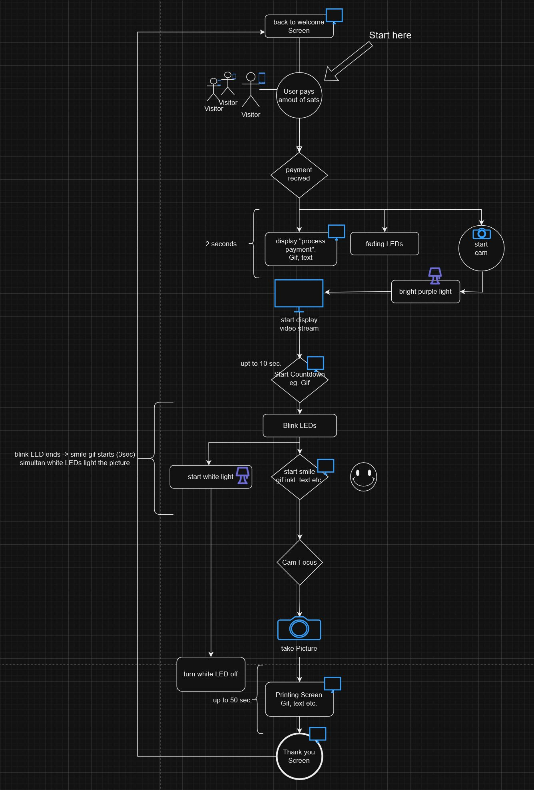

# Doxbox - eine Bitcoin ⚡️ Lightning Fotobox


<p align="center">

</p>

## Schlüsselkomponenten

- **main.py**: Dient als Einstiegspunkt der Anwendung und koordiniert die Ausführung verschiedener Komponenten basierend auf Betriebsmodi.
- **app.py**: Verwaltet die grafische Benutzeroberfläche (GUI) der Anwendung, erleichtert Benutzerinteraktionen und zeigt Informationen an.
- **switch.py**: Behandelt externe API-Interaktionen und führt spezifische Aktionen basierend auf den empfangenen Daten aus, wie das Auslösen anderer Anwendungskomponenten.
- **img_capture.py**: Interagiert mit Kameras, um Bilder aufzunehmen, herunterzuladen und die Dateispeicherung zu verwalten, nutzt gphoto2.
- **print.py (In Arbeit)**: Verbindet sich mit Druckern über CUPS, um Bilder zu drucken, mit Funktionen zur Druckerauswahl und Druckauftragsverwaltung.
- **config.py**: Enthält Konfigurationseinstellungen, die in der gesamten Anwendung verwendet werden, wie API-Schlüssel, Gerätenamen und Dateipfade.

## Hardwareanforderungen

- **Raspberry Pi 4** mit [Debian-Firmware](https://www.raspberrypi.com/software/operating-systems/)
- **DSLR-Kamera**: Canon EOS 450D mit mindestens 1 GB SD-Karte. Bei Verwendung einer anderen Kamera ist die Kompatibilität mit gphoto2 sicherzustellen.
- **Display**: Waveshare 10,4" QLED Quantum Dot Kapazitiver Bildschirm (1600 x 720)
- **Drucker**: Xiaomi-Instant-Photo-Printer-1S, kompatibel mit CUPS, 6" Fotopapier
- **LED**: 4-polige RGB-Leiste, Steckplatine, Kabel, 4 Mosfets
- **Holz**: 3 x 80x80 cm Sperrholz, eventuell ein Laserschneider
- **Magnete**: 20 Eckmagnete (je 2 Stück), 40 x 4 mm Schrauben, 120 x 4 mm Muttern
- **Sprühfarbe**: 1 Dose Grundierung, 4 Dosen Farbe

  

  

## Beispiel Programmablauf:


## Einrichtungsanleitung

1. **Repository klonen**: Beginnen Sie damit, dieses Repository auf Ihren lokalen Rechner zu klonen.

```sh
git clone https://github.com/j0sh21/DoxBox.git
```

2. **Abhängigkeiten installieren**: Stellen Sie sicher, dass Python auf Ihrem System installiert ist, und installieren Sie dann die erforderlichen Python-Pakete.


```sh
pip install -r requirements.txt
```
   **Hinweis**: Einige Komponenten können zusätzliche systemweite Abhängigkeiten erfordern (z.B. gphoto2, CUPS).

   - Wenn Sie zusätzliche systemweite Abhängigkeiten automatisch installieren möchten, führen Sie stattdessen install.sh aus:

      ```sh
      cd DoxBox/install
      chmod u+x install.sh
      ./install.sh
      ```

3. **Konfigurieren**: Überprüfen und aktualisieren Sie `config/cfg.ini` mit Ihren spezifischen Einstellungen, wie Gerätenamen, API-Schlüsseln und Dateipfaden.

## Nutzung

Um die Anwendung auszuführen, navigieren Sie zum Projektverzeichnis und führen Sie `main.py` aus:
 ```sh
python3 main.py
 ```
Für spezifische Funktionen, wie das Aufnehmen eines Bildes oder **Drucken**, können Sie die jeweiligen Skripte ausführen.
```sh
python3 img_capture.py
```
für die Bildaufnahme 

**Drucke ein Bild**: Aktualisiere print.py mit dem Namen dines Druckers und dem Pfad zum Bild, dann führe folgendes aus:
```sh
python3 print.py
```

## Mitwirken

Beiträge zum Projekt sind willkommen! Bitte beachten Sie die Richtlinien für Beiträge, um Informationen darüber zu erhalten, wie Sie Pull Requests einreichen, Probleme melden oder Verbesserungen vorschlagen können.

## Lizenz

Dieses Projekt ist unter der MIT-Lizenz lizenziert - siehe die Datei LICENSE für Details.

## Danksagungen

Ein besonderer Dank gilt allen Mitwirkenden und Betreuern der externen Bibliotheken und Werkzeuge, die in diesem Projekt verwendet werden.
