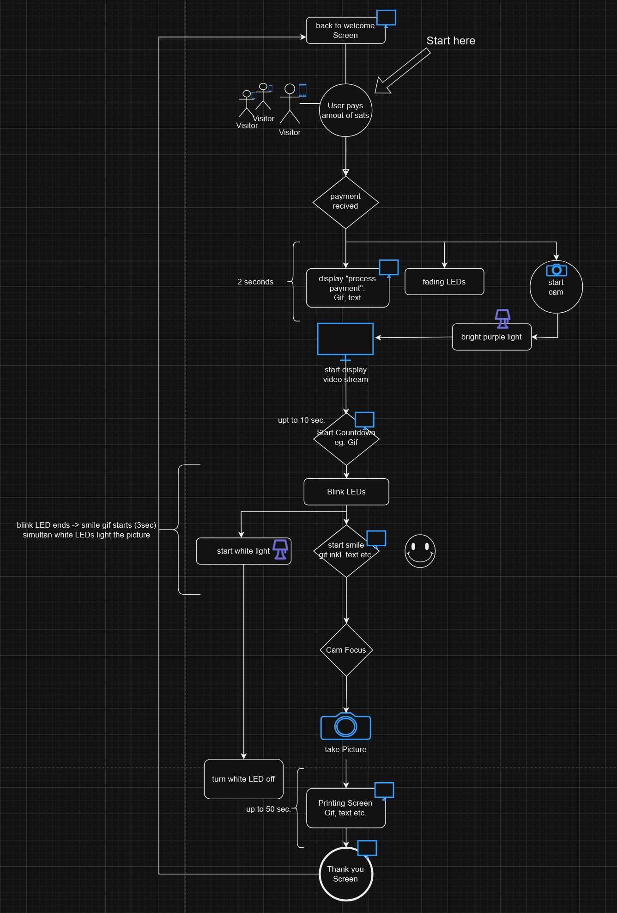

# Doxbox - a bitcoin ⚡️ lightning photobox 

<p align="center">

</p>

Die Doxbox druckt aufgenommene Bilder aus, sobald Bitcoin Lightning-Zahlungen an sein [LNbits-Wallet](https://github.com/lnbits/lnbits) getätigt werden. Sie können es auf jeder Hochzeit, einer Konferenz, einem Treffen oder einem Festival einrichten. Wir haben es modular konstruiert, damit Sie es problemlos mitnehmen können.


## Hardware Requirements

- **Raspberry Pi 4** running the Debian-based operating system [available from Raspberry Pi's official software page.](https://www.raspberrypi.com/software/operating-systems/)
- **DSLR Camera**: Canon EOS 450D with at least 1GB SD-Card. If you use another one [ensure compatibility with gphoto2 on the official website](http://www.gphoto.org/proj/libgphoto2/support.php)
- **Display**: Waveshare 10.4" QLED Quantum Dot Capacitive Display (1600 x 720)
- **Printer**: Xiaomi-Instant-Photo-Printer-1S, supports CUPS printing system, 6" fotopaper
- **LED**: 4-channel RGB LED strip, along with a breadboard, connecting cables, and 4 Mosfets for control.
- **Construction Material**: Three sheets of 80x80cm plywood; access to a laser cutter may be beneficial.
- **Assembly Hardware**: 20 sets of corner magnets (2 pieces per set), 40 screws of 4mm diameter, and 120 nuts of 4mm diameter to secure the components.
- **spray colour**: 1 can of primer, 4 cans of actual colour

  

  
  
  

  
## Example program flow:




## Setup Instructions

### Key Components

- **main.py**: Serves as the entry point of the application, orchestrating the execution of various components based on operational modes.
- **app.py**: Manages the graphical user interface (GUI) of the application, facilitating user interactions and displaying information.
- **switch.py**: Handles external API interactions and performs specific actions based on the received data, such as triggering other application components.
- **img_capture.py**: Interacts with cameras to capture images, download them, and manage file storage, leveraging gphoto2.
- **print.py (In Progress)**: Interfaces with printers using CUPS to print images, with functionality to select printers and manage print jobs.
- **config.py**: Contains configuration settings used across the application, such as API keys, device names, and file paths.

### Installation

1. **Clone the Repository**: Start by cloning this repository.

   ```sh
   git clone https://github.com/j0sh21/DoxBox.git
    ```
2. **Install Dependencies**: Ensure Python is installed on your system, install the required Python packages.

    ```sh

    pip install -r requirements.txt
    ```
    **Note**: Some components may require additional system-level dependencies (e.g., gphoto2, CUPS).
   

   - If you want to install additional system-level dependencies automaticlly run install.sh instead:
      ```sh
      cd DoxBox/install
      chmod u+x install.sh
      ./install.sh

3. **Configure**: Review and update config/cfg.ini with your specific settings, such as device names, API keys and file paths.
   ```sh
   nano cfg.ini
## Usage

To run the application, navigate to the project directory and execute main.py:

 ```sh
python3 main.py
 ```
For specific functionalities, such as capturing an image or printing, you can run the respective scripts (e.g., python img_capture.py for image capture).
Example Usage

**Capture an Image** Ensure your camera is connected and recognized by your system, then run:

 ```sh
python3 img_capture.py
 ```
**Print an Image**: Update print.py with your printer's name and the image file path, then execute:

    python print.py

## License
This project is licensed under the MIT License - see the LICENSE file for details. 
Contributions to the project are welcome! 

## Acknowledgments
Special thanks to [Ben Arc](https://github.com/arcbtc) for [LNbits](https://github.com/lnbits/lnbits) and all maintainers of the external libraries and tools also used in this project.

 ⚡️ [Tip this project](https://legend.lnbits.com/lnurlp/link/4Wc7ZE) if you like the DoxBox ⚡️
